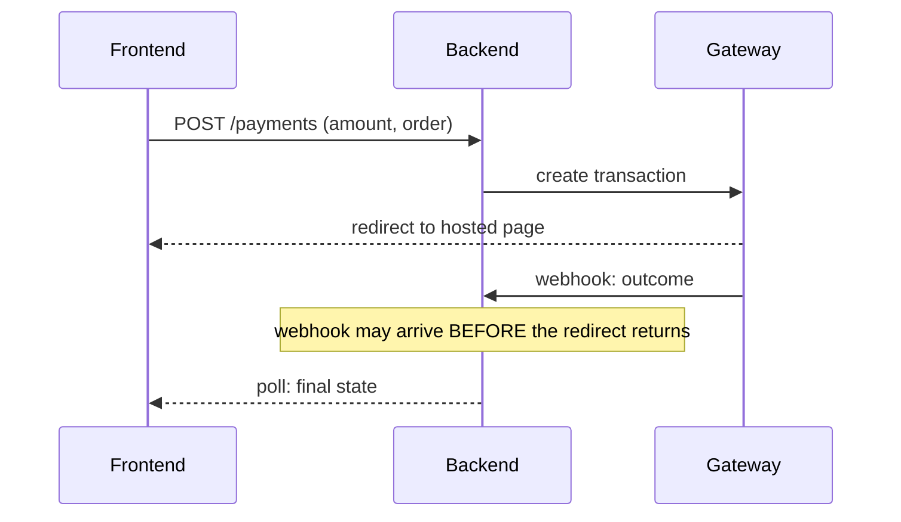

# Format reference

The wiki about the wiki. You do not need this page to start — see the [quickstart](quickstart.md) — but everything the format guarantees is defined here.

Every page is plain markdown with YAML frontmatter and relative links. No build step, no search engine, no plugin: anything that can read files can read the wiki.

**One rule sits above all the others: the wiki describes concepts, not code.** The code is accessible — if a reader needs it, they open it. A page that narrates what a function does duplicates something that is already readable, and duplicates it in a form that goes wrong the moment the function changes. Pages carry what reading the code cannot give you: the *why*, the boundary, the abandoned attempt, the trap. Everything below is in service of that.

---

## The triplet

Every wiki — a per-repository one, or the optional [master wiki](quickstart.md#the-master-wiki--optional) — has exactly three fixed files at its root:

| File | Role |
|---|---|
| `index.md` | the catalog, plus a hand-written **Read first** list. **The front door** — agents read it first and never scan folders |
| `README.md` | the wiki's hat, and the landing page a human hits when browsing the folder: what the repository is — in the master wiki, what the system is — and one line per top-level directory or repository. No frontmatter, so nothing in it that a commit can make false — no `file:line`, no file below the top level. `index.md` links to it from under its title |
| `CHANGELOG.md` | append-only trace of what changed in the wiki and why |

**Rules do not live in any of the three.** A convention — a code style, a testing rule, a constraint that holds for one area — is knowledge about the code, and knowledge about the code goes stale. Put it in a **page**, with full frontmatter, so it carries `covers` and `verified-at` and `portolano stale` can tell you when it has expired. A convention in a README can never be checked.

How many pages those conventions take is nobody's business but yours: a single `conventions.md` is a perfectly good wiki, and so is one page per area when the areas genuinely differ.

`index.md` has two sections. **Read first** holds the pages that must be read before writing code in that area — hand-written, outside the generated markers so regeneration never eats it. **Pages** is the catalog, between `<!-- portolano:index -->` markers, and every page belongs in it: one line, the page's own `summary:` verbatim. **A page that is not listed does not exist** — agents are told to treat what the index does not name as undocumented, so an unlisted page is work that was done and then lost.

The obligation runs both ways: **the index mirrors the wiki.** An entry goes when its page goes, moves when its page moves, and is rewritten when the `summary:` changes — and the slug comes out of every `related:` that named it. A catalog that lists pages which are no longer there is worse than no catalog: it sends the next reader looking for something that was deleted on purpose.

Everything else is domain folders of pages.

---

## Frontmatter

| Field | Required | What it's for |
|---|---|---|
| `title` | ✅ | human title |
| `slug` | ✅ | wiki-relative id (path minus `.md`); unique; what `related` and the index refer to |
| `type` | ✅ | what kind of page this is |
| `status` | ✅ | how much to trust it |
| `summary` | ✅ | one line, reused verbatim in `index.md` |
| `updated` | ✅ | date of the last content change |
| `related` | ✅ (may be empty) | slugs of neighbouring pages — this *is* the link graph |
| `covers` | for code pages | globs of the source paths the page describes |
| `verified-at` | for code pages | the commit the page was last checked against |

*(`covers` uses git's `:(glob)` pathspec, the same syntax as the per-repository `skip:` list in `portolano.yaml`.)*

| `evidence` | recommended | how you know: `read`, `inferred` or `run` |
| `tags` | optional | free keywords |

### `covers` and `verified-at`

The two fields the rest of the format exists to support.

```yaml
verified-at: 4312f47                       # the commit the page was checked against
covers: [src/services/notification/**]     # the paths the page describes
```

```bash
git log --oneline 4312f47..HEAD -- ':(glob)src/services/notification/**'
```

The `:(glob)` prefix is not decoration: it stops `*` from crossing a `/`, so a page that declares `src/*.php` is not woken up by a commit three directories down.

Empty means fresh; non-empty means **suspect, not wrong**. Either way the answer is the same field: advance `verified-at` to the commit you checked against.

Three rules that keep this honest:

| Rule | Why |
|---|---|
| The unit is **the page**, not the wiki | "the wiki is stale" is not actionable; "these four pages are suspect" is |
| The commit is the **described repository's**, not the parent's | with pinned submodules the parent's pointer does not move, so it is not a source of truth about freshness |
| `covers` is **declared, not inferred** | a page states its own scope. Nothing has to guess which code a paragraph is about |

---

## The vocabularies

| `type` | What the page is |
|---|---|
| `overview` | the entry page of a domain |
| `reference` | durable how-it-works |
| `analysis` | an investigation and its findings |
| `plan`, `proposal` | intended work; an idea under discussion |
| `audit`, `estimate`, `tdd` | point-in-time artifacts |

| `status` | How much to trust it |
|---|---|
| `active` | current and trustworthy |
| `draft` | in progress, or written without verification |
| `superseded` | replaced — link the replacement in `related` |
| `archived` | kept for history, not current |

| `evidence` | How you know |
|---|---|
| `read` | learned by reading the source |
| `inferred` | deduced, not directly observed |
| `run` | observed by actually running it |

Two consequences worth stating out loud:

- **Transient artifacts live in the domain folder**, next to the reference pages, and are told apart by frontmatter rather than by location. An old spec does not become rubbish — it becomes `superseded`.
- **A page written from reading alone stays `draft`** until someone runs the thing. `evidence` is the cheapest anti-hallucination lever there is: it stops *"read at `file:line`"* and *"inferred"* from looking alike.

---

## Linking

| Rule | Why |
|---|---|
| `related:` is an adjacency list **inside the page** | it is edited together with the content, so it cannot drift out of sync with it — unlike a separate graph file |
| keep `related` roughly reciprocal | if A lists B, B usually lists A; orphans are a defect |
| in prose, use **relative markdown links** | `./sibling.md`, `../other-domain/page.md` — they work in every renderer |
| **never `[[wikilinks]]`** | they need tooling to resolve, and the whole point is that none is required |

---

## The body

**The format does not fix the body.** Frontmatter is the contract — machines read it, and `portolano stale` depends on it. Below the closing `---` a page is prose and tables meant for people, and a mandatory skeleton is how a wiki becomes something only agents write and nobody edits.

So this is a good default, not a schema:

| Section | What goes in it |
|---|---|
| What it does | the conclusion, not the investigation |
| Where it lives | a table of `file:line` — never pasted code, which rots silently |
| Gotchas | the non-obvious, and above all the *why* |
| Open questions | what you did not resolve. Declare it; do not drop it |

Drop a section with nothing under it, add one the subject needs, reorder them. The guardrail is not the headings — it is the three rules under [What actually makes pages bloat](#what-actually-makes-pages-bloat), which hold whatever shape you choose.

### How big should a page be?

**There is no line limit, and there should not be one.** A cap invites two different failures and only prevents one of them.

The unit is not length, it is **subject**. A page answers *one question*, completely. That is the whole rule; everything below is how to tell when you have broken it.

| Failure | What it looks like | The test |
|---|---|---|
| **Too big** | the page narrates an investigation, or covers two subjects that happen to live in the same folder. Prose swells; nobody reads to the end | does this page answer **more than one question**? Does its `covers` span modules that have nothing to do with each other? → **split it** |
| **Too fragmented** | a page that is mostly `related:` links. The reader has to open three more to assemble an answer, and the crosslinks cost more than the content | can an agent **act on this page without opening another**? If not → **merge it back** |

The second failure is the one people create while fixing the first, so it is worth naming: a wiki of forty stubs that all point at each other is worse than four honest pages. Splitting is encouraged, not mandatory, and never for its own sake.

`covers` is the most reliable split signal you have: **if a page's globs cover two unrelated parts of the tree, it is already two pages** — and splitting it makes both halves easier to verify, because each gets its own `verified-at`.

### What actually makes pages bloat

Prose is the failure mode. A model writes the way it talks, and an unconstrained context file grows without bound — measured across 2,303 files in [*Agent READMEs*](https://doi.org/10.1145/3840295) and across 247,694 instruction lifetimes in [arXiv:2608.11095](https://arxiv.org/abs/2608.11095), which found prompts more than tripling over their lifetime and older instructions becoming *less* likely to ever be deleted.

Three rules push back, and none of them is about size:

1. **Tables and lists instead of paragraphs.**
2. **No narrative of the discovery.** The result, not the voyage. This is where most of the weight comes from.
3. **Changelog entries stay under ~200 characters**: `DATE slug what changed (why)`. This one *is* a hard cap, because a changelog has a fixed job. If a finding deserves more room it belongs in a page, and the changelog links to it.

> A changelog that outgrows its own pages is a changelog that stole their job.

The same research explains why the one thing a page must carry is the ***why***, under whatever heading you put it: once an instruction's rationale is gone, deleting it safely becomes intractable, so it never gets deleted. **Recording the why is what makes removal possible later.**

---

## Diagrams

Optional, never required — but for anything that crosses a boundary, a diagram earns its place faster than three paragraphs do. The clearest case is an integration with an external system, where the question is always *who calls whom, in what order, and what happens when a step fails*.

**Use Mermaid, in the page.** It renders natively on GitHub and in most editors, needs no build step, and — because it is text — it diffs in git like everything else.

````markdown

````

| Rule | Why |
|---|---|
| Mermaid in the page, not a binary image | an image cannot be diffed, cannot be reviewed, and rots invisibly. If you genuinely need a binary, put it in `assets/` and say in the page when it was drawn |
| The diagram is **part of the page** | it is covered by the same `verified-at`. A diagram that no longer matches the code is a stale page, not a decoration |
| Draw the **interaction**, not the class hierarchy | sequence and flow diagrams pay for themselves; a diagram that restates the directory tree does not |
| Put the trap in the diagram | the `Note over` above carries the gotcha that costs a day to rediscover. That is the whole reason the picture is there |

---

## The router

The always-loaded entry file — `AGENTS.md`, with `CLAUDE.md` and other adapters generated from it — is a **router, not a manual**. It carries:

- which code lives where, and which wiki governs it
- the mandatory reads before writing code in each area
- the hard rules of the project

It does **not** carry a repository overview, domain knowledge, or anything else that belongs on a page. Two reasons, one of each kind:

| Reason | Why |
|---|---|
| Empirical | [arXiv:2602.11988](https://arxiv.org/abs/2602.11988) found instructions in context files are followed well, while repository overviews — popular and widely recommended — do not help and add cost |
| Structural | the router is loaded every session; pages are fetched when needed. What goes in the router is paid for always |

### Inheritance

`AGENTS.md` and `CLAUDE.md` have **opposite** nesting semantics: nested `AGENTS.md` files override, nested `CLAUDE.md` files concatenate. The same tree means different things to different tools. That is why one format is the source and the others are compiled from it, never maintained in parallel.
